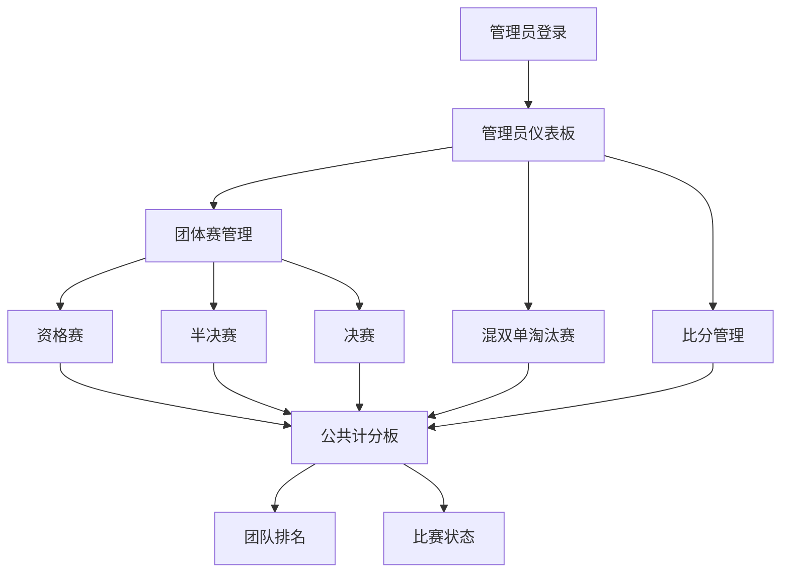

# Pickle Ball Challenge Scoreboard - Product Requirements Document

## 1. Product Overview
一个基于网页的匹克球挑战赛计分板应用，为观众显示实时团队排名、比分和排位，同时为管理员提供安全的比分管理控制。

本应用解决了匹克球锦标赛中对有组织、专业计分系统的需求。比赛包含6个小组，每组派出男双、女双、混双三支队伍参加团体赛，另外还有混双单淘汰赛。观众可以轻松跟踪比赛进程和团队位置，确保只有授权人员可以更新比分。

## 2. Core Features

### 2.1 User Roles
| Role | Registration Method | Core Permissions |
|------|---------------------|------------------|
| Spectator | No registration required | Can view scoreboard, team rankings, and match status |
| Admin | Password-protected login | Can update team names, scores, match status, and manage tournament settings |

### 2.2 Feature Module
我们的匹克球计分板应用包含以下主要页面：
1. **公共计分板**: 实时计分显示、团队排名、当前比赛状态
2. **团体赛管理**: 资格赛、半决赛、决赛的比赛管理和计分
3. **混双单淘汰赛**: 独立的单淘汰赛制管理和计分
4. **管理员仪表板**: 比分管理、团队管理、比赛控制面板
5. **管理员登录**: 管理员安全认证

### 2.3 Page Details
| Page Name | Module Name | Feature description |
|-----------|-------------|---------------------|
| 公共计分板 | 实时计分显示 | 显示当前比赛比分、团队名称、比赛进程，自动刷新 |
| 公共计分板 | 团队排名 | 显示6个小组的总体锦标赛排名、胜负记录、积分 |
| 公共计分板 | 比赛状态 | 显示当前比赛信息、下一场比赛、锦标赛对阵图 |
| 团体赛管理 | 资格赛管理 | 管理18场资格赛（6组×3类型），随机抽签对战，21分制计分 |
| 团体赛管理 | 半决赛管理 | 管理前4名小组的半决赛，3场比赛决定胜负 |
| 团体赛管理 | 决赛管理 | 管理冠亚军决赛，季军殿军排位 |
| 混双单淘汰赛 | 淘汰赛管理 | 管理混双单淘汰赛，独立计分系统，不计入团体排名 |
| 管理员仪表板 | 比分管理 | 更新比赛比分、设置比赛获胜者、修改积分总数 |
| 管理员仪表板 | 团队管理 | 添加/编辑/删除团队、更新团队名称、管理选手名单 |
| 管理员仪表板 | 比赛控制 | 开始/结束比赛、设置比赛时间表、控制锦标赛流程 |
| 管理员登录 | 身份验证 | 密码保护的安全登录、会话管理 |

## 3. Core Process

**观众流程：**
观众直接访问公共计分板，无需认证。可以查看实时比分、团队排名和比赛状态，自动更新。

**管理员流程：**
管理员必须通过安全登录页面进行身份验证。认证后，访问管理员仪表板来管理团队、更新比分和控制比赛流程。

**比赛流程：**
1. **第一轮资格赛**：6个小组各派出男双、女双、混双队伍，通过抽签决定对手，每场21分制，胜者得1分
2. **第二轮半决赛**：总分最高的4个小组晋级，通过抽签决定对手，3场比赛决定胜负
3. **第三轮决赛**：半决赛胜者进行冠军战，负者为季军、殿军
4. **混双单淘汰赛**：独立进行，不计入团体排名，单淘汰制决出混双冠军

## 4. User Interface Design

### 4.1 Design Style
- Primary colors: Deep green (#2D5016) and bright yellow (#FFD700) for pickle ball theme
- Secondary colors: White (#FFFFFF) and light gray (#F5F5F5) for backgrounds
- Button style: Rounded corners with subtle shadows, hover effects
- Font: Clean sans-serif (Arial, Helvetica) with large, readable sizes (18px+ for scores)
- Layout style: Card-based design with clear sections, responsive grid layout
- Icons: Simple, sports-themed icons with consistent styling

### 4.2 Page Design Overview
| Page Name | Module Name | UI Elements |
|-----------|-------------|-------------|
| Public Scoreboard | Live Scoreboard Display | Large score cards with team names, bold score numbers (48px), color-coded match status indicators |
| Public Scoreboard | Team Rankings | Sortable table with position numbers, team names, win/loss records, clean alternating row colors |
| Public Scoreboard | Match Status | Current match highlight box, upcoming matches list, tournament bracket visualization |
| Admin Dashboard | Score Management | Input fields for scores, increment/decrement buttons, save/update action buttons |
| Admin Dashboard | Team Management | Team list with edit/delete actions, add team form, player roster management |
| Admin Login | Authentication | Centered login form, password field, secure login button, error message display |

### 4.3 Responsiveness
The application is mobile-first responsive design, optimized for both desktop viewing (spectators on large screens) and mobile/tablet access (admins updating scores courtside). Touch-friendly buttons and inputs for mobile admin use.
