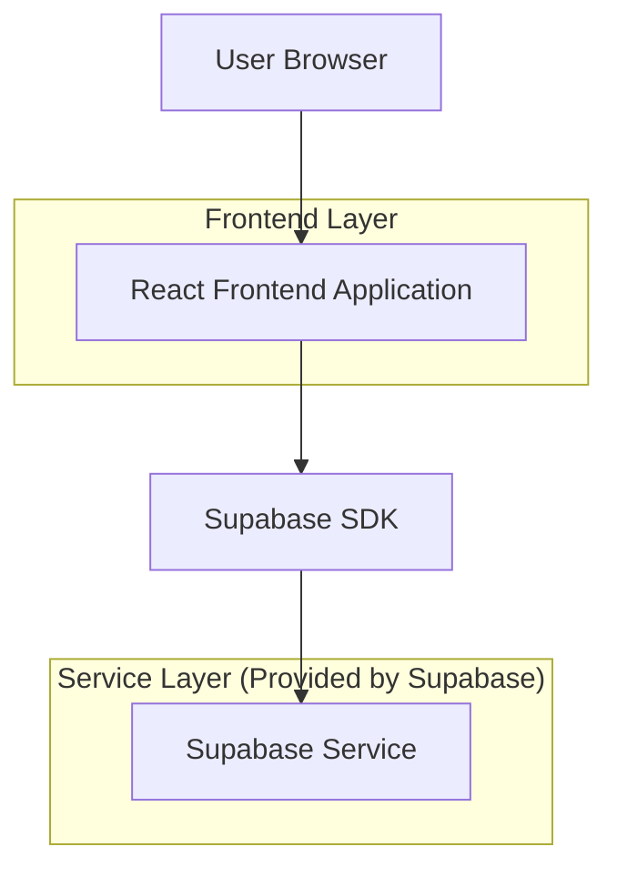
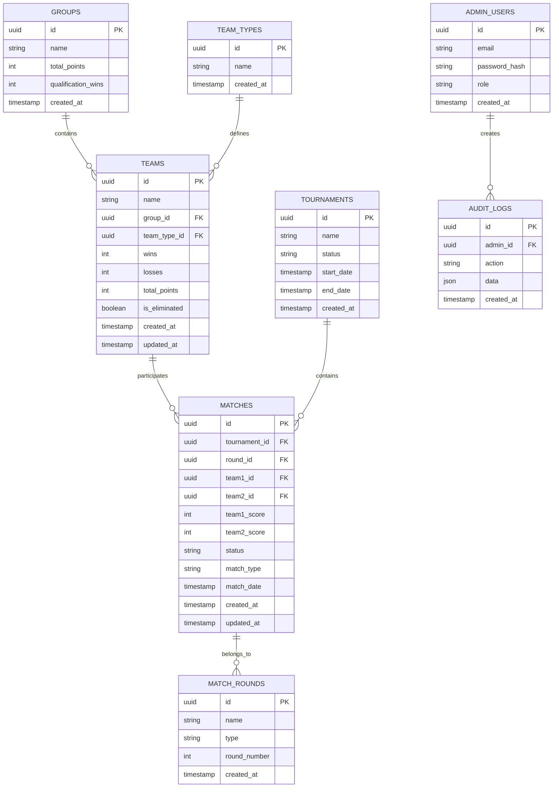

# Pickle Ball Scoreboard - Technical Architecture Document

## 1. Architecture Design



## 2. Technology Description

* Frontend: React\@18 + tailwindcss\@3 + vite

* Backend: Supabase (Authentication, Database, Real-time subscriptions)

* Deployment: Vercel or Netlify for frontend hosting

## 3. Route Definitions

| Route                    | Purpose                                                        |
| ------------------------ | -------------------------------------------------------------- |
| /                        | 公共计分板页面，显示实时比分和团队排名                         |
| /admin/login             | 管理员认证页面，安全访问控制                                   |
| /admin/dashboard         | 管理员控制面板，管理比分和团队                                 |
| /admin/group-tournament  | 团体赛管理界面，包含资格赛、半决赛、决赛                       |
| /admin/elimination       | 混双单淘汰赛管理界面                                           |
| /admin/teams             | 团队管理界面，添加/编辑6个小组及其队伍                         |
| /admin/matches           | 比赛控制界面，管理锦标赛流程                                   |

## 4. API Definitions

### 4.1 Core API

**Team Management**

```
GET /api/teams
```

Response:

| Param Name  | Param Type | Description             |
| ----------- | ---------- | ----------------------- |
| id          | string     | Unique team identifier  |
| name        | string     | Team name               |
| wins        | number     | Number of wins          |
| losses      | number     | Number of losses        |
| points      | number     | Total points scored     |
| created\_at | string     | Team creation timestamp |

**Score Updates**

```
PUT /api/matches/:id/score
```

Request:

| Param Name    | Param Type | isRequired | Description                               |
| ------------- | ---------- | ---------- | ----------------------------------------- |
| team1\_score  | number     | true       | Score for team 1                          |
| team2\_score  | number     | true       | Score for team 2                          |
| match\_status | string     | true       | Match status (active, completed, pending) |

**Authentication**

```
POST /api/auth/login
```

Request:

| Param Name | Param Type | isRequired | Description         |
| ---------- | ---------- | ---------- | ------------------- |
| email      | string     | true       | Admin email address |
| password   | string     | true       | Admin password      |

Response:

| Param Name    | Param Type | Description                          |
| ------------- | ---------- | ------------------------------------ |
| access\_token | string     | JWT token for authenticated requests |
| user          | object     | User profile information             |

## 5. Data Model

### 5.1 Data Model Definition



### 5.2 Data Definition Language

**Teams Table**

```sql
-- Create teams table
CREATE TABLE teams (
    id UUID PRIMARY KEY DEFAULT gen_random_uuid(),
    name VARCHAR(100) NOT NULL,
    wins INTEGER DEFAULT 0,
    losses INTEGER DEFAULT 0,
    total_points INTEGER DEFAULT 0,
    created_at TIMESTAMP WITH TIME ZONE DEFAULT NOW(),
    updated_at TIMESTAMP WITH TIME ZONE DEFAULT NOW()
);

-- Create index
CREATE INDEX idx_teams_name ON teams(name);
CREATE INDEX idx_teams_wins ON teams(wins DESC);

-- Grant permissions
GRANT SELECT ON teams TO anon;
GRANT ALL PRIVILEGES ON teams TO authenticated;
```

**Matches Table**

```sql
-- Create matches table
CREATE TABLE matches (
    id UUID PRIMARY KEY DEFAULT gen_random_uuid(),
    tournament_id UUID REFERENCES tournaments(id),
    team1_id UUID REFERENCES teams(id),
    team2_id UUID REFERENCES teams(id),
    team1_score INTEGER DEFAULT 0,
    team2_score INTEGER DEFAULT 0,
    status VARCHAR(20) DEFAULT 'pending' CHECK (status IN ('pending', 'active', 'completed')),
    match_date TIMESTAMP WITH TIME ZONE,
    created_at TIMESTAMP WITH TIME ZONE DEFAULT NOW(),
    updated_at TIMESTAMP WITH TIME ZONE DEFAULT NOW()
);

-- Create indexes
CREATE INDEX idx_matches_tournament ON matches(tournament_id);
CREATE INDEX idx_matches_status ON matches(status);
CREATE INDEX idx_matches_date ON matches(match_date);

-- Grant permissions
GRANT SELECT ON matches TO anon;
GRANT ALL PRIVILEGES ON matches TO authenticated;
```

**Tournaments Table**

```sql
-- Create tournaments table
CREATE TABLE tournaments (
    id UUID PRIMARY KEY DEFAULT gen_random_uuid(),
    name VARCHAR(200) NOT NULL,
    status VARCHAR(20) DEFAULT 'upcoming' CHECK (status IN ('upcoming', 'active', 'completed')),
    start_date TIMESTAMP WITH TIME ZONE,
    end_date TIMESTAMP WITH TIME ZONE,
    created_at TIMESTAMP WITH TIME ZONE DEFAULT NOW()
);

-- Grant permissions
GRANT SELECT ON tournaments TO anon;
GRANT ALL PRIVILEGES ON tournaments TO authenticated;
```

**Admin Users Table**

```sql
-- Create admin_users table
CREATE TABLE admin_users (
    id UUID PRIMARY KEY DEFAULT gen_random_uuid(),
    email VARCHAR(255) UNIQUE NOT NULL,
    password_hash VARCHAR(255) NOT NULL,
    role VARCHAR(20) DEFAULT 'admin' CHECK (role IN ('admin', 'super_admin')),
    created_at TIMESTAMP WITH TIME ZONE DEFAULT NOW()
);

-- Grant permissions (admin users table should be restricted)
GRANT ALL PRIVILEGES ON admin_users TO authenticated;

-- Insert default admin user
INSERT INTO admin_users (email, password_hash, role)
VALUES ('admin@pickleball.com', '$2b$10$example_hash', 'admin');
```

**Groups and Teams Tables**

```sql
-- Create groups table for 6 groups
CREATE TABLE groups (
    id UUID PRIMARY KEY DEFAULT gen_random_uuid(),
    name VARCHAR(50) NOT NULL,
    total_points INTEGER DEFAULT 0,
    qualification_wins INTEGER DEFAULT 0,
    created_at TIMESTAMP WITH TIME ZONE DEFAULT NOW()
);

-- Create team_types table
CREATE TABLE team_types (
    id UUID PRIMARY KEY DEFAULT gen_random_uuid(),
    name VARCHAR(20) NOT NULL CHECK (name IN ('男双', '女双', '混双')),
    created_at TIMESTAMP WITH TIME ZONE DEFAULT NOW()
);

-- Create match_rounds table
CREATE TABLE match_rounds (
    id UUID PRIMARY KEY DEFAULT gen_random_uuid(),
    name VARCHAR(50) NOT NULL,
    type VARCHAR(20) NOT NULL CHECK (type IN ('团体赛', '混双单淘汰赛')),
    round_number INTEGER NOT NULL,
    created_at TIMESTAMP WITH TIME ZONE DEFAULT NOW()
);

-- Update teams table to include group and type
ALTER TABLE teams ADD COLUMN group_id UUID REFERENCES groups(id);
ALTER TABLE teams ADD COLUMN team_type_id UUID REFERENCES team_types(id);
ALTER TABLE teams ADD COLUMN is_eliminated BOOLEAN DEFAULT FALSE;

-- Update matches table to include round and match type
ALTER TABLE matches ADD COLUMN round_id UUID REFERENCES match_rounds(id);
ALTER TABLE matches ADD COLUMN match_type VARCHAR(20) DEFAULT '团体赛' CHECK (match_type IN ('团体赛', '混双单淘汰赛'));

-- Grant permissions
GRANT SELECT ON groups TO anon;
GRANT ALL PRIVILEGES ON groups TO authenticated;
GRANT SELECT ON team_types TO anon;
GRANT ALL PRIVILEGES ON team_types TO authenticated;
GRANT SELECT ON match_rounds TO anon;
GRANT ALL PRIVILEGES ON match_rounds TO authenticated;

-- Initial Sample Data
```sql
-- Insert sample tournament
INSERT INTO tournaments (name, status, start_date)
VALUES ('教会匹克球挑战赛 2024', 'active', NOW());

-- Insert team types
INSERT INTO team_types (name) VALUES ('男双'), ('女双'), ('混双');

-- Insert 6 groups
INSERT INTO groups (name) VALUES 
    ('苍玉组'), ('玛瑙组'), ('璧玺组'), ('翡翠组'), ('珊瑚组'), ('琥珀组');

-- Insert match rounds
INSERT INTO match_rounds (name, type, round_number) VALUES 
    ('资格赛', '团体赛', 1),
    ('半决赛', '团体赛', 2),
    ('决赛', '团体赛', 3),
    ('混双单淘汰赛', '混双单淘汰赛', 1);

-- Insert sample teams (18 teams total: 6 groups × 3 types)
INSERT INTO teams (name, group_id, team_type_id, wins, losses, total_points)
SELECT 
    g.name || t.name,
    g.id,
    t.id,
    0, 0, 0
FROM groups g
CROSS JOIN team_types t;
```

